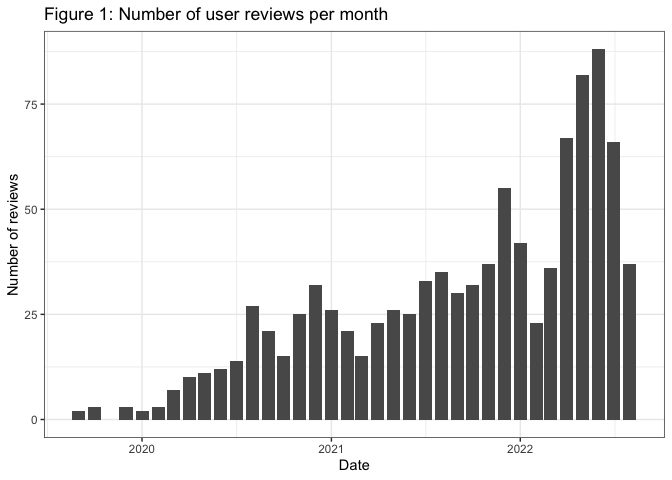
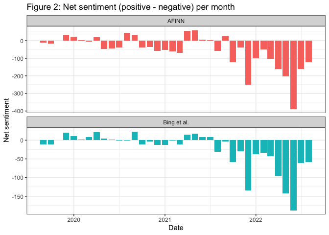
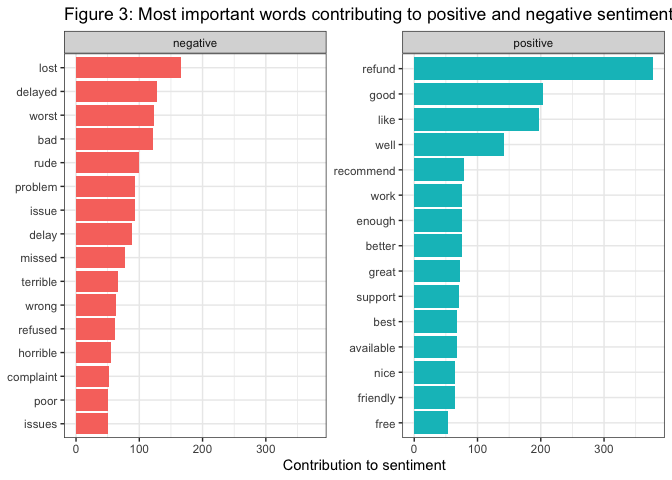
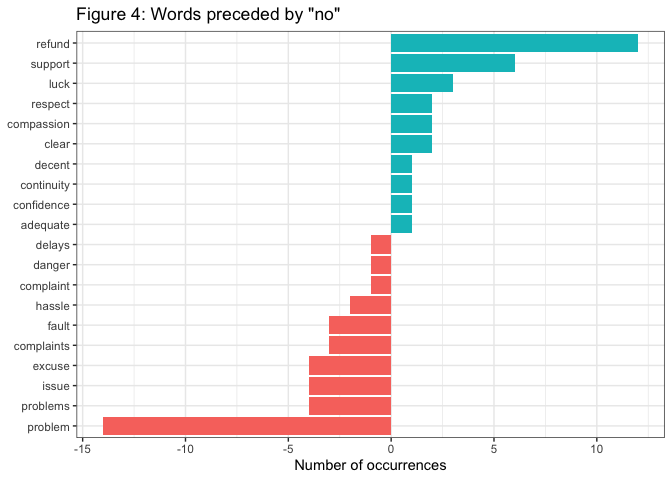
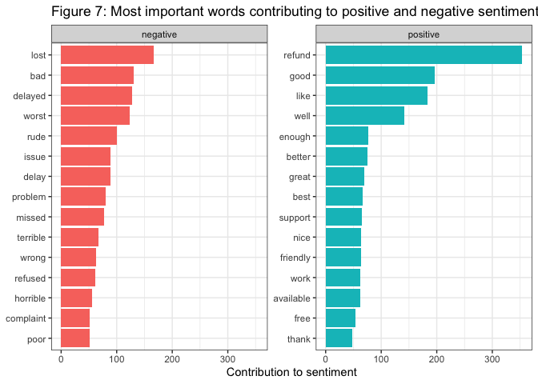
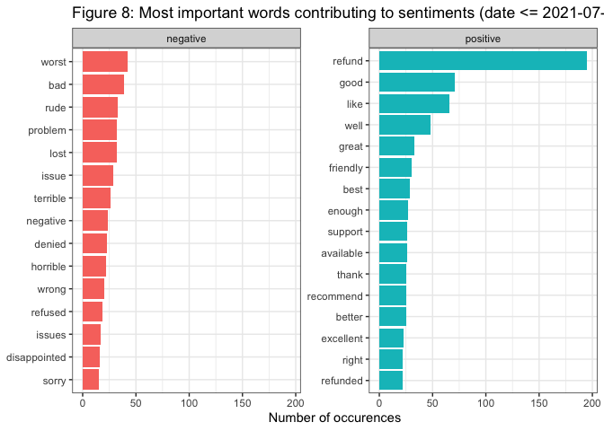
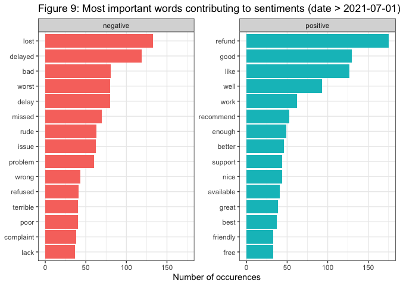

Sentiment Analysis for user reviews of KLM using R
================
Bernardo S.B.C. Lima
2022-09-02

## Introduction

Sentiment Analysis (also known as opinion mining) is an automated
process for capturing the emotional tone behind written or spoken
language. This is an important tool for organizations to determine and
categorize users’ opinions about its products or services.

With the covid-19 pandemic winding down, passengers are starting to fly
once again. But the return of air travel has been anything but easy,
with airlines and airports struggling with shortage of staff and
resources. Against this backdrop, **the objective of this project is to
investigate passengers perception of KLM services using sentiment
analysis**.

## Load libraries

``` r
# Load libraries
library(tidyverse) # collection of r packages for data science
library(tm)  # for text mining
library(tidytext) # for text mining
library(SnowballC) # for text stemming (i.e. collapsing words to a common root to aid comparison of vocabulary)
library(skimr) # summary statistics
library(lubridate) # for manipulating dates
library(stringi) # for text manipulation
library(wordcloud) # for creating wordcloud plots
library(mgsub) 
library(scales) 
library(widyr)
library(reshape2)
library(ggraph)
library(igraph)
library(bookdown)
```

## Data collection

To answer the question above, I collected the 1000 most recent user
reviews of KLM in TripAdvisor. You can refer to my **[Github
repository](https://github.com/bernardo-lima/tripadvisor-scraper)** for
the source code for the Tripadvisor scraper.

### Data cleaning and validation

Before analyzing the data, I performed the following steps to clean and
validate the data. You can refer to R script on this Github repository
for the complete source code.

-   Unify text encoding  
-   Check for duplicates  
-   Make all text lowercase  
-   Transform contraction with auxiliary verb and not  
-   Remove the numbers  
-   Remove the punctuation  
-   Trim white space  
-   Fix common typos

### Overview of the data and descriptive statistics

The final sample comprises 997 user reviews in English of KLM on
Tripadvisor. The sample cover user reviews from trips made between
2019-09-01 to 2022-08-01.

``` r
# Average review_score
klm %>% 
  summarise(n = n(), 
            mean_score = round(mean(review_score, na.rm = T),1)) 
```

    ## # A tibble: 1 × 2
    ##       n mean_score
    ##   <int>      <dbl>
    ## 1   997        1.9

``` r
# Number of reviews per month
klm %>% ggplot(aes(x = travel_date)) +
  geom_bar() +
  labs(title = "Figure 1: Number of user reviews per month",
       x = "Date",
       y = "Number of reviews") +
  theme_bw()
```



Figure 1 plots the number of user reviews of overtime. The **number of
reviews significantly increases over time** and is probably strongly
correlated with the number of actual passenger travels.

The **average review score in the sample is 1.9**, while the overall
review score of KLM on Tripadvisor across all languages and time(n =
32.023) is 4.0. This relative low review scores is not surprising given
the challenges airlines are currently facing.

## Preparation for the sentiment analysis

### Comparing BING and AFINN sentiment dictionaries

A sentiment analysis dictionary contains information about the emotions
expressed in words of text fragments. A dictionary usually provides
scores for classifying the sentiment of each word. These scores can then
be used to compute the overall sentiment of text fragment or document.
Two popular sentiment dictionaries are BING and AFFIN. Before performing
the analysis, it is important to investigate if the analysis results are
consistent across different dictionaries.

``` r
klm_tidy <- klm %>% 
  unnest_tokens(word, review_text)

afinn_sent <- klm_tidy %>% 
  inner_join(get_sentiments("afinn")) %>% 
  group_by(index = travel_date) %>% 
  summarise(sentiment = sum(value)) %>% 
  mutate(method = "AFINN")
```

    ## Joining, by = "word"

``` r
bing_sent <- klm_tidy %>% 
  inner_join(get_sentiments("bing")) %>%
  count(index = travel_date, sentiment) %>%
  pivot_wider(names_from = sentiment,
              values_from = n,
              values_fill = 0) %>% 
  mutate(sentiment = positive - negative) %>% 
  mutate(method = "Bing et al.")
```

    ## Joining, by = "word"

``` r
bind_rows(afinn_sent, 
          bing_sent) %>%
  ggplot(aes(index, sentiment, fill = method)) +
  geom_col(show.legend = FALSE) +
  facet_wrap(~method, ncol = 1, scales = "free_y") +
  labs(title = "Figure 2: Net sentiment (positive - negative) per month",
       x = "Date",
       y = "Net sentiment") +
  theme_bw()
```



Figure 2 plots the net sentiment (positive - negative) using the BING
and AFINN dictionaries. The net sentiment per month is similar across
both dictionaries. Suggesting that the analysis and conclusions are
robust and not dependent on the type of dictionary used. Given the
similarity across the dictionaries, I proceed the analysis with Bing. et
al.

It’s also important to note that there seems to be a structural break in
the net sentiment of users’ reviews. **The net sentiment becomes
considerably more negative from July 2021 onward.**

### Most common positive and negative words

``` r
klm_tidy %>%
  inner_join(get_sentiments("bing"), by = "word" ) %>%
  count(word, sentiment, sort = TRUE) %>%
  ungroup() %>% 
  group_by(sentiment) %>%
  slice_max(n, n = 15) %>% 
  ungroup() %>%
  mutate(word = reorder(word, n)) %>%
  ggplot(aes(n, word, fill = sentiment)) +
  geom_col(show.legend = FALSE) +
  facet_wrap(~sentiment, scales = "free_y") +
  labs(title = "Figure 3: Most important words contributing to positive and negative sentiment",
       x = "Contribution to sentiment",
       y = NULL) +
  theme_bw()
```



The Figure 3 above shows the most common positive and negative words
used in the users reviews, and illustrates how much each word
contributed to positve and negative sentiments. This figure also allows
us spot potential problems in the data. For instance, the word “refund”
is the biggest contributor for the overall positive sentiment. However,
there might be instances that “refund” might have been used to express a
negative sentiment context, such as when one did received “no refund”. I
investigate this issue and address it in the next section.

### Sentiment shifters (using bigrams to provide context in sentiment analysis)

By performing sentiment analysis on the bigram data, we can examine how
often sentiment-associated words are preceded by common negating words,
such as “not”. We can then use this information to ignore or even
reverse their contribution of certain words to the sentiment score.

``` r
negation_words <- c("not", "no", "never", "without")

negated_words <- klm %>%
  unnest_tokens(bigram, review_text, token = "ngrams", n = 2) %>%
  count(bigram, sort = TRUE) %>%
  separate(bigram, c("word1", "word2"), sep = " ") %>%
  filter(word1 %in% negation_words) %>%
  inner_join(get_sentiments("bing"), by = c(word2 = "word")) %>%
  mutate(sentiment = ifelse(sentiment == "positive", 1, -1)) %>%
  mutate(contribution = sentiment * n) %>%
  mutate(word2 = reorder(word2, contribution))

# Illustration using "no"
negated_words %>% 
  filter(word1 == "no") %>%
  mutate(contribution = n * sentiment) %>%
  arrange(desc(abs(contribution))) %>%
  head(20) %>%
  mutate(word2 = reorder(word2, contribution)) %>%
  ggplot(aes(n * sentiment, word2, fill = n * sentiment > 0)) +
  geom_col(show.legend = FALSE) +
  labs(title = "Figure 4: Words preceded by \"no\"",
      x = "Number of occurrences",
       y = NULL) +
  theme_bw()
```



Figure 4 shows the top 20 preceded by the word “no” illustrates the
challenge. The “problem” is often used to describe a negative sentiment.
However, when it follows a negation word such as “no” or “not”, its
meaning is reversed. I address this problem below by recoding the most
common positive and negatived words preceded by the most common
sentiment shifter words (also know as valence shifters).

``` r
bing <-get_sentiments("bing")
# Pick the most effective sentiment shifters
negated_phrases <- c("not recommend",
                     "no problem",
                     "not work",
                     "not worth",
                     "not like",
                     "no refund",
                     "not helpful",
                     "not refund",
                     "no support",
                     "not good",
                     "not available",
                     "not sufficient",
                     "never recommend",
                     "no issue",
                     "no problems",
                     "not easy",
                     "not great",
                     "not respect",
                     "not willing",
                     "never refunded"
)
# Find synonyms for the phrases above to replace
synonyms <- c("not_recommend",
              "benefit",
              "unworkable",
              "unworthy",
              "dislike",
              "no_refund",
              "unhelpful",
              "no_refund",
              "unsupported",
              "bad",
              "unavailable",
              "insufficient",
              "not_recommend",
              "satisfied",
              "benefit",
              "hard",
              "bad",
              "disrespect",
              "unwilling",
              "no_refund"
)
# Replace the negations with their synonyms.
review_text_corrected <- mgsub(klm$review_text, negated_phrases, synonyms) %>%
  dplyr::as_tibble() %>% 
  rename(review_text = value)
 
klm_corrected <- klm 
klm_corrected$review_text <- review_text_corrected$review_text
klm_tidy_corrected <- klm_corrected %>% 
  unnest_tokens(word, review_text)

custom_bing <- bind_rows(tibble(word= c("no_refund", "no_refunds", "not_recommend" ),
                                sentiment = c("negative","negative","negative")),
                               bing)
```

We can now proceed with the final sentiment analysis using the
“corrected” data set.

## Sentiment Analysis

### Wordclouds

I’ll first plot a word cloud to spot the most common words used in the
user reviews.

``` r
# Ignore words that are frequent but doesn't help.
ignore_words <- tibble(word = c("klm",
                                "flight", 
                                "flights",
                                "airport",
                                "amsterdam"))
# create a words freq table
word_freq_table <- klm_corrected %>% 
  unnest_tokens(word, review_text) %>%
  anti_join(stop_words) %>%
  anti_join(ignore_words) %>%
  count(word, sort = TRUE)
```

    ## Joining, by = "word"
    ## Joining, by = "word"

``` r
# Plotting a wordcloud
layout(matrix(c(1, 2), nrow=2), heights=c(1, 4))
par(mar=rep(0, 4))
plot.new()
text(x=0.5, y=0.5, "Figure 5: Wordcloud for KLM's user reviews")
word_freq_table %>% 
  filter(n>100) %>%
  with(wordcloud(word, n,
                 scale = c(5,0.2),
                 colors = brewer.pal(8, "Dark2")))
```


We can also create a word cloud with the most common words used to
express negative and positive sentiments

``` r
# Positive/Negative cloud
layout(matrix(c(1, 2), nrow=2), heights=c(1, 4))
par(mar=rep(0, 4))
plot.new()
text(x=0.5, y=0.5, "Figure 6: Wordcloud for KLM's user reviews by sentiment type")
klm_tidy_corrected %>%
  inner_join(custom_bing) %>%
  count(word, sentiment, sort = TRUE) %>%
  acast(word ~ sentiment, value.var = "n", fill = 0) %>%
  comparison.cloud(colors = c("#F8766D", "#00BFC4"), # colors from ggplot2
                   max.words = 100,
                   title.colors=NULL, 
                   match.colors=TRUE,
                   title.size=3)
```

    ## Joining, by = "word"


Although word clouds are useful to paint the overall picture, bar charts
sorted by the contribution of individual words allows a more fine
grained analysis.

``` r
# Most common positive and negative words
klm_tidy_corrected %>%
  inner_join(custom_bing, by = "word" ) %>%
  count(word, sentiment, sort = TRUE) %>%
  ungroup() %>% 
  group_by(sentiment) %>%
  slice_max(n, n = 15) %>% 
  ungroup() %>%
  mutate(word = reorder(word, n)) %>%
  ggplot(aes(n, word, fill = sentiment)) +
  geom_col(show.legend = FALSE) +
  facet_wrap(~sentiment, scales = "free_y") +
  labs(title = "Figure 7: Most important words contributing to positive and negative sentiment",
       x = "Contribution to sentiment",
       y = NULL) +
  theme_bw()
```



Figure 7 above lists the most important words contributing to positive
and negative sentiment. As I have noted earlier, there seems to be a
structural break in the net sentiment of users’ reviews around July
2021. The net sentiment becomes considerably more negative after July
2021. This shift in user sentiment coincides with huge increased of user
reviews. Although I do not have data on the actual number of passengers,
it is to assume that number of reviews correlates with the number of
actual flights. Thus, it is useful to create this same plot for reviews
done before and after July 2021 to understand what is driving the
negative perception of KLM services.

``` r
# Sentiment contribution for reviews up to July 2021
klm_tidy %>%
  filter(travel_date <= "2021-07-01") %>% 
  inner_join(get_sentiments("bing")) %>%
  count(word, sentiment, sort = TRUE) %>%
  ungroup() %>%
  group_by(sentiment) %>%
  slice_max(n, n = 15) %>% 
  ungroup() %>%
  mutate(word = reorder(word, n)) %>%
  ggplot(aes(n, word, fill = sentiment)) +
  geom_col(show.legend = FALSE) +
  facet_wrap(~sentiment, scales = "free_y") +
  labs(title = "Figure 8: Most important words contributing to sentiments (date <= 2021-07-01)",
       x = "Number of occurences",
       y = NULL)  +
  theme_bw()
```

    ## Joining, by = "word"



``` r
# Sentiment contribution for reviews after July 2021
klm_tidy %>%
  filter(travel_date > "2021-07-01") %>% 
  inner_join(get_sentiments("bing")) %>%
  count(word, sentiment, sort = TRUE) %>%
  ungroup() %>%
  group_by(sentiment) %>%
  slice_max(n, n = 15) %>% 
  ungroup() %>%
  mutate(word = reorder(word, n)) %>%
  ggplot(aes(n, word, fill = sentiment)) +
  geom_col(show.legend = FALSE) +
  facet_wrap(~sentiment, scales = "free_y") +
  labs(title = "Figure 9: Most important words contributing to sentiments (date > 2021-07-01)",
       x = "Number of occurences",
       y = NULL) +
  theme_bw()
```

    ## Joining, by = "word"



Figure 8 plots list the top negative and positive words for user reviews
of trips that occurred before or during July 2021, while Figure 9 plots
the same information for trips that happened after July 2021.
Contrasting these two figures it is possible to conclude that *the
increase in the net negative sentiment of KLM user after July 2021 is
largely to due to (lost) luggage, (flight) delays and relative reduction
in number of refunds*.

### Most common bigrams (two words)

In order to assess the robustness of these conclusions and to provide
more context to the interpretation of individual words, I created a
wordcloud with the most common bigrams (Figure 10) and a network graph
with the most importnat word relationships in KLM user reviews (Figure
11).

``` r
# Most Common Bigrams
layout(matrix(c(1, 2), nrow=2), heights=c(1, 4))
par(mar=rep(0, 4))
plot.new()
text(x=0.5, y=0.5, "Figure 10: Most common bigrams in KLM user reviews")
klm_corrected %>%
  unnest_tokens(bigram, review_text, token = "ngrams", n = 2) %>%
  count(bigram, sort = TRUE) %>%
  separate(bigram, c("word1", "word2"), sep = " ") %>%
  filter(!word1 %in% stop_words$word & !word2 %in% stop_words$word) %>%
  filter(n>15) %>%
  unite(word, word1:word2, sep = " ") %>%
  with(wordcloud(word, n,
                 scale = c(3,0.5),
                 colors = brewer.pal(8, "Dark2")))
```


``` r
bigram_counts_corrected <- klm_corrected %>%
  unnest_tokens(bigram, review_text, token = "ngrams", n = 2) %>% 
  separate(bigram, c("word1", "word2"), sep = " ") %>%
  filter(!word1 %in% stop_words$word) %>%
  filter(!word2 %in% stop_words$word) %>% 
  count(word1, word2, sort = TRUE) 

bigram_graph_corrected <- bigram_counts_corrected %>%
  filter(n > 15) %>%
  graph_from_data_frame()

a <- grid::arrow(type = "closed", length = unit(.15, "inches"))

bigram_graph_corrected %>% ggraph(layout = "fr") +
  geom_edge_link(aes(edge_alpha = n), show.legend = FALSE,
                 arrow = a, end_cap = circle(.07, 'inches')) +
  geom_node_point(color = "lightblue", size = 5) +
  geom_node_text(aes(label = name), vjust = 1, hjust = 1) +
  theme_void() +
  ggtitle("Figure 11: Most importnat word relationships in KLM user reviews")
```


## Summary of findings

The objective of this project was to investigate passengers perception
of KLM services using sentiment analysis. To answer this question, I
scraped the 1000 most recent user reviews of KLM in TripAdvisor. The
final sample comprises 997 user reviews in English of KLM on Tripadvisor
from trips made between 2019-09-01 to 2022-08-01.

-   The average review score in the sample is 1.9.
-   The number of monthly reviews increased significantly during the
    observation window. Assuming that the number of user reviews is a
    function of actual passenger trips, it is possible to conclude that
    there was a strong and abrupt demand for air travel due to the
    easing of covid-19 travel restrictions.
-   There seems to be a structural break in the net sentiment
    (positive - negative) of user reviews. The net sentiment was neutral
    up to to July 2021 and become strongly negative from July 2021
    onward (see Figure 2)
-   This shift in user sentiment seem to coincide with the sudden
    increase in the number of passengers flying.
-   The increase in the net negative sentiment of KLM user after July
    2021 seem to be largely driven by (lost) luggage, (flight) delays
    and relative reduction in number of refunds.
